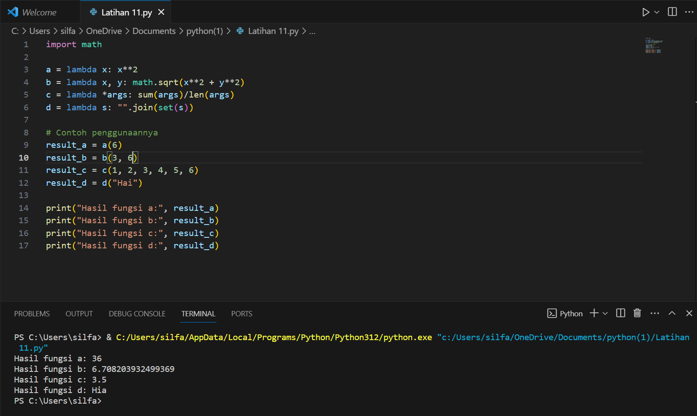
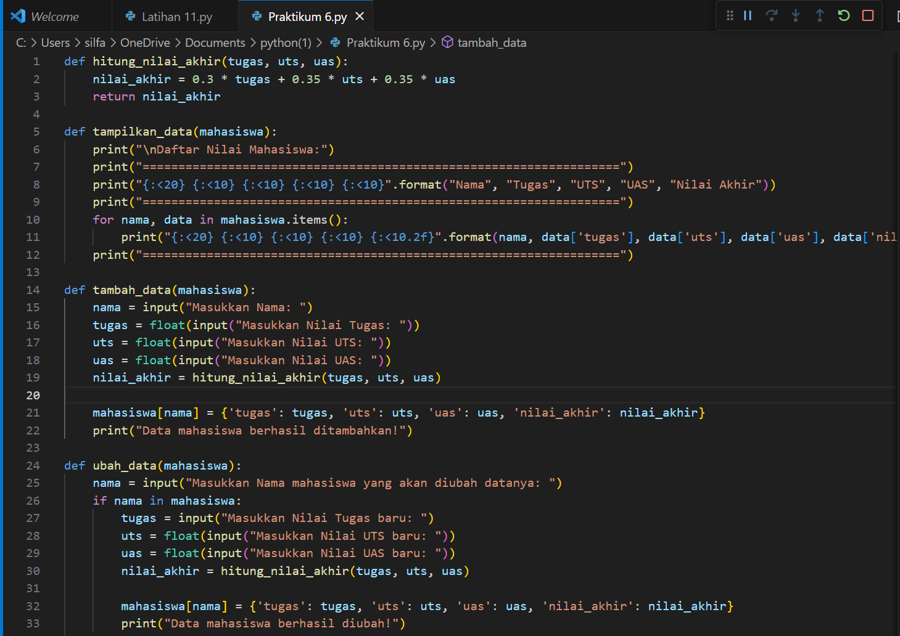
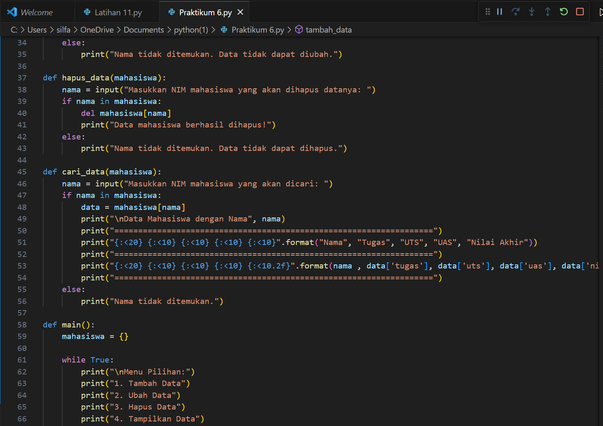
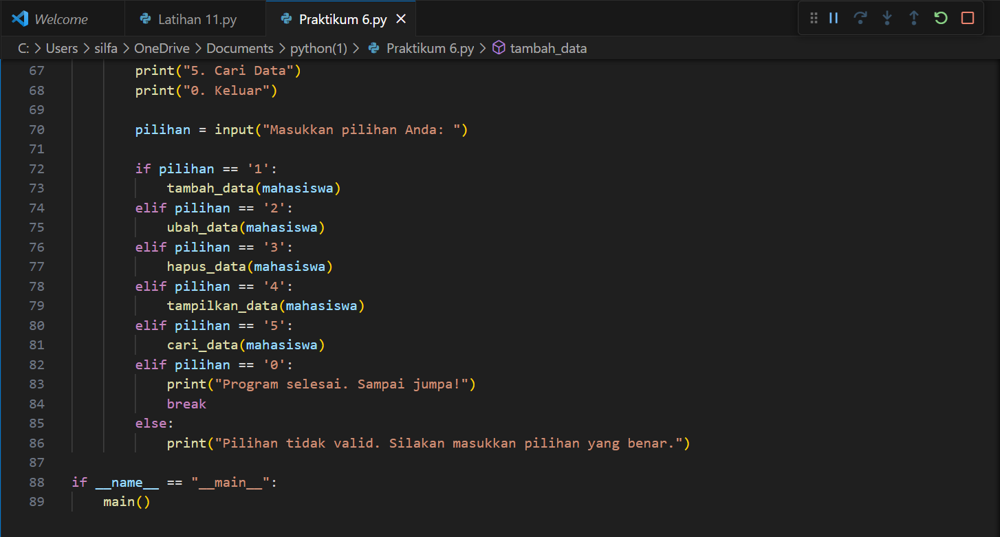
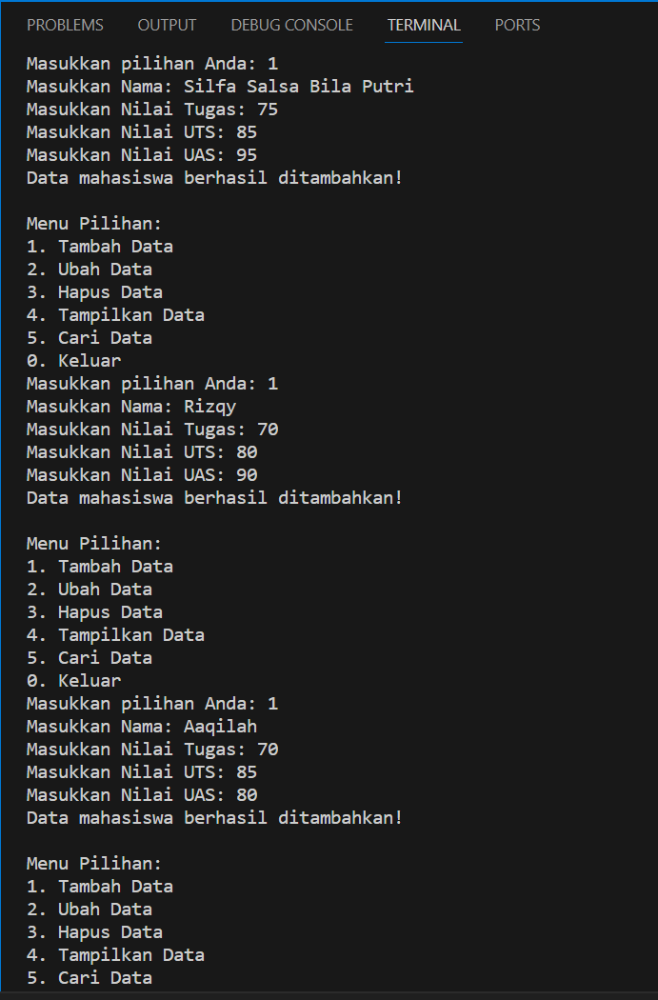
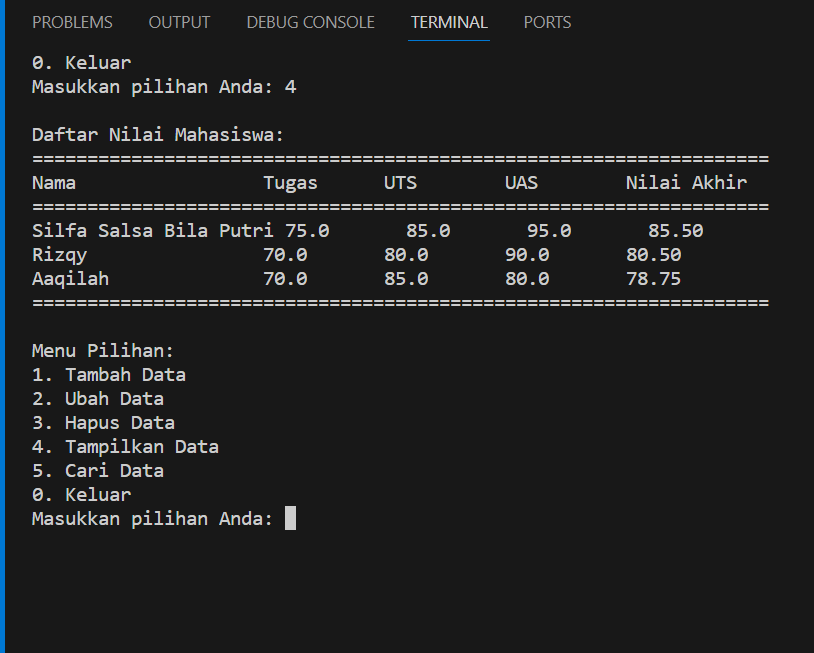

# LANGKAH-LANGKAH LATIHAN
1. Import lah lambang yang akan digunkan
2. Lalu masukkan contoh penggunaaan dari setiap lambang yang sudah dibuat
3. Setelah itu print data yang sudah di buat
4. Langkah terakhir run lah hasilnya
# LATIHAN

# LANGKAH-LANGKAH PRAKTIKUM
1. Masukkan lah nilai-nilai akhir yaitu seperti tugas, UTS, dan UAS
2. Menampilakan data yang berisi (Nama, Nilai Tugas, Nilai UTS, dan Nilai UAS)
3. Ubahlah data dengan memasukan nama kembali
4. Jika ingin menghapus data maka masukan nama yang akan di hapus
5. Mencari data dengan cara memasukan nama yang akan di cari
6. Else blok kode di bawah else akan akan di jalankan jika semua kondisi dalam if dan elif sebelumnya bernilai False.
# PRAKTIKUM

